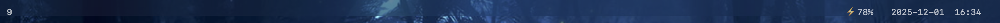

# ybar

A lightweight, configurable menubar replacement for macOS.




## Features

- Translucent
- Clock
- AeroSpace workspace indicator
- Configurable

## Requirements

- macOS 10.15 or later
- Swift compiler (Xcode command line tools)
- Native macOS menubar set to "always hide" or "auto hide"
- AeroSpace window manager (optional, for workspace indicator)

## Installation

```bash
$ make
$ sudo make install
```

This installs:
- `ybar` binary to `/usr/local/bin/`
- Man page to `/usr/local/share/man/man1/`

## Configuration

Create `~/.ybar.conf` with your preferences:

```ini
# Bar appearance
height = 24
opacity = 0.7
blur = true

# Elements to show
show_clock = true
show_workspace = true

# Clock configuration
clock_format = HH:mm:ss
font_size = 13
text_color = #FFFFFF

# Workspace configuration
workspace_prefix = 
```

## Usage

Start ybar:
```bash
ybar
```

With custom configuration:
```bash
ybar --conf /path/to/config
```

View help:
```bash
$ ybar --help
```

View version:
```bash
$ ybar --version
```

View manual:
```bash
$ man ybar
```

## Configuration Options

| Option | Type | Default | Description |
|--------|------|---------|-------------|
| `height` | number | 24 | Bar height in pixels |
| `opacity` | number | 0.7 | Background opacity (0.0-1.0) |
| `blur` | boolean | true | Enable blur effect |
| `show_clock` | boolean | true | Show clock |
| `show_workspace` | boolean | true | Show workspace indicator |
| `clock_format` | string | HH:mm:ss | Time format (strftime style) |
| `font_size` | number | 13 | Font size for text |
| `text_color` | hex | #FFFFFF | Text color |
| `workspace_prefix` | string | "" | Prefix for workspace name |

## Building from Source

```bash
make
```

## Removing

```text
# make uninstall
```

## License

See [LICENSE](LICENSE) file for details.

## Authors

See [AUTHORS](AUTHORS) file for contributors.
